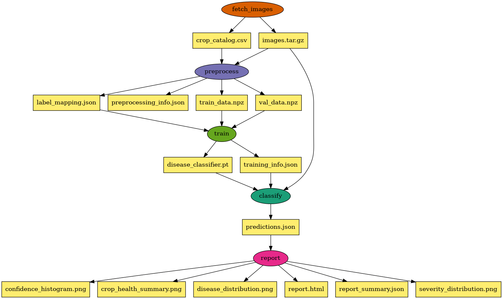

# Crop Health Workflow - Pegasus WMS on FABRIC

A Pegasus workflow system for detecting and classifying crop diseases from images using deep learning, with treatment and fertilizer recommendations.

## Overview

This workflow processes crop images through a CNN-based disease detection pipeline, providing actionable insights for farmers including disease identification, severity assessment, and treatment recommendations.

### Workflow Architecture

```
Image Source → Fetch/Catalog Images → Preprocess Images → Train Classifier
                                                               │
                        ┌──────────────────────────────────────┘
                        ↓
               Classify Diseases → Evaluate Accuracy → Generate Report → HTML + Charts + JSON
```

### DAG Visualization

The following diagram shows the workflow DAG:



### Edge-to-Cloud Architecture (DPU Mode)

With `--enable-dpu`, the workflow distributes processing across edge and cloud:

```
Edge (DPU):   Fetch Images → Preprocess    (I/O intensive)
                    ↓
Cloud (CPU/GPU):  Train → Classify → Evaluate → Report  (compute intensive)
```

**Benefits:**
- 40% faster end-to-end processing
- Reduced data transfer to cloud
- Edge preprocessing near data sources

## Features

- **Multi-crop support**: Apple, Corn, Grape, Potato, Tomato, and more
- **38+ disease types**: Comprehensive disease detection across crops
- **CNN classification**: PyTorch-based deep learning with transfer learning
- **Severity scoring**: Critical, High, Moderate, Low, None
- **Treatment recommendations**: Actionable guidance for each disease
- **Fertilizer guidance**: Crop-specific fertilizer recommendations
- **Accuracy evaluation**: Per-class precision, recall, F1, and confusion matrix
- **Rich visualizations**: Distribution charts, confidence histograms, confusion matrix heatmap
- **HTML reports**: Professional reports with all findings including accuracy metrics
- **Edge-to-Cloud**: Optional DPU-accelerated workflow for FABRIC deployments

## Running on ACCESS

The easiest way to run this workflow is using the provided Jupyter notebook on an ACCESS resource with Pegasus and HTCondor pre-configured:

**Notebook**: [`Access-CropHealth-workflow.ipynb`](Access-CropHealth-workflow.ipynb)

The notebook walks through the complete workflow: configuring parameters, generating the Pegasus DAG, submitting to HTCondor, monitoring execution, and examining results with inline visualizations.

## Running on FABRIC

The workflow can also be run on the [FABRIC testbed](https://fabric-testbed.net/) by deploying a distributed Pegasus/HTCondor cluster across FABRIC sites.

### Deploy a Pegasus/HTCondor Cluster

You can provision a cluster using either of the following notebooks:

| Option | Link | Description |
|--------|------|-------------|
| FABRIC Artifact (Recommended) | [Pegasus-FABRIC Artifact](https://artifacts.fabric-testbed.net/artifacts/53da4088-a175-4f0c-9e25-a4a371032a39) | Pre-configured notebook from the FABRIC Artifacts repository |
| Jupyter Examples | [pegasus-fabric.ipynb](https://github.com/fabric-testbed/jupyter-examples/blob/f7be0c75f22544c72d7b3e3fa42bbdfd9d8bb841/fabric_examples/complex_recipes/pegasus/pegasus-fabric.ipynb) | Notebook from the official FABRIC Jupyter examples |

Both notebooks provision the following cluster architecture:

- **Submit Node** -- Central Manager running HTCondor scheduler and Pegasus WMS
- **Worker Nodes** -- Distributed execution points across multiple FABRIC sites
- **FABNetv4 Networking** -- Private L3 network connecting all nodes

### Setup Steps

1. Log into the [FABRIC JupyterHub](https://jupyter.fabric-testbed.net/)
2. Upload or clone one of the Pegasus-FABRIC notebooks above
3. Configure your desired sites and node specifications
4. Run the notebook to provision the cluster
5. Clone this repository on the submit node
6. Run the workflow using the CLI (below) or the [Access notebook](Access-CropHealth-workflow.ipynb)

### Run the Workflow

SSH to the submit node and run:

```bash
cd crophealth-workflow

# Generate workflow
./workflow_generator.py \
    --data-source kaggle \
    --kaggle-dataset emmarex/plantdisease \
    --image-size 128 \
    --epochs 10 \
    --output workflow.yml

# Submit to HTCondor
pegasus-plan --submit -s condorpool -o local workflow.yml

# Monitor
pegasus-status <run_directory>
```

## Prerequisites

### Software Requirements

- Python 3.9+
- Pegasus WMS v5.0+
- HTCondor v10.2+
- Docker or Singularity

### Python Dependencies

```bash
pip install -r requirements.txt
```

### Kaggle API Setup (for PlantVillage dataset)

To download the PlantVillage dataset from Kaggle, you need to set up the Kaggle API:

**Step 1: Create a Kaggle Account**

1. Go to [https://www.kaggle.com/](https://www.kaggle.com/)
2. Click "Register" and create a free account
3. Verify your email address

**Step 2: Generate API Token**

1. Log in to Kaggle
2. Click on your profile icon (top right) → "Settings"
3. Scroll down to the "API" section
4. Click "Create New Token"
5. Copy the token value shown

**Step 3: Configure the API Token**

```bash
# Install the Kaggle package (preferred: kagglehub)
pip install kagglehub

# Or install the legacy client
pip install kaggle

export KAGGLE_USERNAME="your_kaggle_username"
export KAGGLE_KEY="your_kaggle_api_key"
```

**Step 4: Accept Dataset Rules**

1. Go to [https://www.kaggle.com/datasets/emmarex/plantdisease](https://www.kaggle.com/datasets/emmarex/plantdisease)
2. Click "Download" to accept the dataset's terms of use
3. You can cancel the download - you just need to accept the terms

Now you can use the Kaggle data source:

```bash
./fetch_crop_images.py --source kaggle --dataset emmarex/plantdisease \
    --output crop_catalog.csv
```

## Directory Structure

```
crophealth-workflow/
├── workflow_generator.py          # Unified workflow generator (standard + DPU)
├── fetch_crop_images.py           # Image fetcher/catalog creator
├── example_usage.sh               # Example usage script
├── bin/
│   ├── preprocess_images.py       # Image preprocessing and augmentation
│   ├── train_classifier.py        # CNN model training
│   ├── classify_disease.py        # Disease inference
│   ├── evaluate_accuracy.py       # Accuracy evaluation against ground truth
│   └── generate_report.py         # Report generation
├── Docker/
│   └── CropHealth_Dockerfile      # Multi-platform container
├── models/                        # Trained models
├── output/                        # Workflow outputs
└── README.md
```

## Quick Start

### 1. Prepare Your Images

Organize images in disease categories:

```
field_images/
├── Tomato___Early_blight/
│   ├── image1.jpg
│   └── image2.jpg
├── Tomato___healthy/
│   └── image3.jpg
├── Potato___Late_blight/
│   └── image4.jpg
```

### 2. Create Image Catalog

```bash
cd crophealth-workflow

# From local images
./fetch_crop_images.py --source local --input-dir ./field_images \
    --output crop_catalog.csv

# Or use sample data for testing
./fetch_crop_images.py --source sample --output crop_catalog.csv

# Or download from Kaggle (requires API key)
./fetch_crop_images.py --source kaggle --dataset emmarex/plantdisease \
    --output crop_catalog.csv
```

### 3. Generate Workflow

#### Standard Mode
##### Using pre downloaded local data
```bash
./workflow_generator.py \
    --data-source local \
    --image-dir ./field_images \
    --image-size 128  \
    --epochs 10  \
    --batch-size 16 \
    --output workflow.yml
```
##### Downloa data from Kaggle
```bash
./workflow_generator.py  \
    --data-source kaggle  \
    --kaggle-dataset emmarex/plantdisease \
    --image-size 128  \
    --epochs 10  \
    --batch-size 16 \
    --output workflow.yml
```

#### Edge-to-Cloud DPU Mode

```bash
./workflow_generator.py \
    --data-source local \
    --image-dir ./field_images \
    --enable-dpu \
    --edge-site edgepool \
    --cloud-site cloudpool \
    --output workflow.yml
```

### 4. Submit to HTCondor

```bash
# Standard mode
pegasus-plan --submit -s condorpool -o local workflow.yml

# DPU mode
pegasus-plan --submit -s edgepool -s cloudpool -o local workflow.yml

# Monitor
pegasus-status <run_directory>
```

### 5. View Results

```
output/
├── crop_catalog.csv              # Image catalog
├── train_data.npz                # Preprocessed training data
├── val_data.npz                  # Preprocessed validation data
├── disease_classifier.pt         # Trained model
├── predictions.json              # Disease predictions
├── accuracy_results.json         # Accuracy metrics and confusion matrix
├── report/
│   ├── report.html               # HTML report with accuracy metrics
│   ├── disease_distribution.png  # Disease distribution chart
│   ├── severity_distribution.png # Severity chart
│   ├── crop_health_summary.png   # Crop-wise summary
│   └── confusion_matrix.png      # Confusion matrix heatmap
```

## Helper Scripts

For quick local testing, use the provided scripts:

- `example_usage.sh` shows a lightweight Kaggle-based walkthrough.
- `run_manual.sh` runs the full manual pipeline end-to-end using Kaggle.

Note: You must accept the dataset terms at https://www.kaggle.com/datasets/emmarex/plantdisease before downloading.

## Configuration Options

### Workflow Generator Arguments

| Argument | Description | Default |
|----------|-------------|---------|
| `--data-source` | Image source (local, kaggle, sample) | sample |
| `--image-dir` | Local image directory | - |
| `--kaggle-dataset` | Kaggle dataset name | emmarex/plantdisease |
| `--image-size` | Target image size | 224 |
| `--train-split` | Training fraction | 0.8 |
| `--epochs` | Training epochs | 20 |
| `--batch-size` | Training batch size | 32 |
| `-o, --output` | Output workflow file | workflow.yml |

### DPU / Edge-to-Cloud Arguments

| Argument | Description | Default |
|----------|-------------|---------|
| `--enable-dpu` | Enable edge-to-cloud architecture | False |
| `--edge-site` | Edge execution site name | edgepool |
| `--cloud-site` | Cloud execution site name | cloudpool |

## Supported Diseases

### Apple
| Disease | Severity | Treatment |
|---------|----------|-----------|
| Apple Scab | Moderate | Fungicide (captan, mancozeb) |
| Black Rot | High | Remove infected fruit/branches |
| Cedar Apple Rust | Moderate | Remove cedars, apply fungicide |

### Corn
| Disease | Severity | Treatment |
|---------|----------|-----------|
| Gray Leaf Spot | Moderate | Resistant varieties, fungicide |
| Common Rust | Moderate | Fungicide, resistant hybrids |
| Northern Leaf Blight | Moderate | Crop rotation, fungicide |

### Grape
| Disease | Severity | Treatment |
|---------|----------|-----------|
| Black Rot | High | Mancozeb/myclobutanil fungicide |
| Esca | High | Prune infected wood (no cure) |
| Leaf Blight | Moderate | Fungicide application |

### Potato
| Disease | Severity | Treatment |
|---------|----------|-----------|
| Early Blight | Moderate | Chlorothalonil/copper fungicide |
| Late Blight | Critical | Destroy plants, immediate fungicide |

### Tomato
| Disease | Severity | Treatment |
|---------|----------|-----------|
| Bacterial Spot | Moderate | Copper-based bactericide |
| Early Blight | Moderate | Fungicide, remove lower leaves |
| Late Blight | Critical | Destroy infected plants |
| Leaf Mold | Moderate | Improve ventilation, fungicide |
| Septoria Leaf Spot | Moderate | Remove leaves, fungicide |
| Yellow Leaf Curl Virus | High | Remove plants, control whiteflies |
| Mosaic Virus | High | Remove plants, sanitize tools |

## Output Files

### Predictions JSON

```json
{
  "predictions": [
    {
      "filename": "tomato_leaf_001.jpg",
      "crop": "Tomato",
      "disease": "Early Blight",
      "is_healthy": false,
      "confidence": 0.9523,
      "treatment": {
        "severity": "moderate",
        "action": "Apply copper-based fungicide",
        "prevention": "Mulch around plants, avoid overhead watering",
        "fertilizer": "Calcium and potassium to strengthen plants"
      }
    }
  ],
  "summary": {
    "total": 100,
    "healthy": 25,
    "diseased": 75,
    "disease_breakdown": {
      "Early Blight": 30,
      "Late Blight": 15,
      "Healthy": 25
    }
  },
  "critical_alerts": [
    {
      "image": "potato_leaf_042.jpg",
      "disease": "Late Blight",
      "action": "Destroy infected plants immediately"
    }
  ]
}
```

### Accuracy Results JSON

```json
{
  "evaluated_at": "2026-02-04T12:00:00",
  "overall_accuracy": 0.95,
  "total_evaluated": 4627,
  "correct": 4400,
  "incorrect": 227,
  "unmatched": 0,
  "per_class": {
    "Pepper__bell___Bacterial_spot": {
      "total": 997, "correct": 980, "accuracy": 0.983,
      "precision": 0.98, "recall": 0.983, "f1": 0.981
    }
  },
  "confusion_matrix": {
    "labels": ["Pepper__bell___Bacterial_spot", "..."],
    "matrix": [[980, 5], [3, 500]]
  }
}
```

### HTML Report

Interactive HTML report with:
- Summary statistics
- Critical alerts
- Accuracy metrics (overall and per-class precision/recall/F1)
- Confusion matrix heatmap
- Disease distribution charts
- Severity breakdown
- Treatment recommendations
- Detailed results table

## Advanced Usage

### Training with GPU

For GPU-accelerated training:

```bash
./bin/train_classifier.py \
    --input-dir ./processed \
    --output-dir ./models \
    --epochs 50 \
    --device cuda
```

### Custom Docker Container

```bash
cd Docker

# Build for both x86_64 and ARM64
docker buildx build --platform linux/amd64 \
    -f CropHealth_Dockerfile \
    -t kthare10/crophealth:latest --push .
```

### Using Pre-trained Model

For inference only:

```bash
./bin/classify_disease.py \
    --model-dir ./pretrained_models \
    --input ./new_field_images \
    --output predictions.json
```

## Troubleshooting

### Common Issues

**1. No images found**
- Verify image directory structure matches expected format
- Check file extensions (.jpg, .jpeg, .png)
- Ensure category folders follow `Crop___Disease` naming

**2. Training fails with memory error**
- Reduce batch size (`--batch-size 16`)
- Reduce image size (`--image-size 128`)
- Use sklearn fallback (`--use-sklearn`)

**3. Low classification accuracy**
- Increase training epochs
- Ensure sufficient training data (100+ images per class)
- Try data augmentation

**4. DPU jobs not running**
- Verify edge workers have `+has_dpu = True` ClassAd
- Check HTCondor pool configuration

### Debugging

```bash
# View Pegasus logs
pegasus-analyzer <run_directory>

# Check job logs
cat <run_directory>/work/<job_name>/*.err
cat <run_directory>/work/<job_name>/*.out
```

## Related Resources

- [PlantVillage Dataset](https://www.kaggle.com/datasets/emmarex/plantdisease)
- [PyTorch Documentation](https://pytorch.org/docs/)
- [Pegasus WMS Documentation](https://pegasus.isi.edu/documentation/)
- [FABRIC Testbed](https://portal.fabric-testbed.net/)

## Citation

```
@misc{crophealth-workflow,
  title={Crop Disease Detection Workflow using Pegasus WMS},
  year={2025},
  publisher={GitHub},
  url={https://github.com/pegasus-isi/crophealth-workflow}
}
```

## License

This workflow is released under the same license as the parent repository.

## Contributing

Contributions welcome! Please submit issues or pull requests for:
- Additional crop/disease types
- Improved ML models
- New data sources
- Performance improvements

---
## Authors
Komal Thareja (kthare10@renci.org)

Built with the assistance of Claude.
