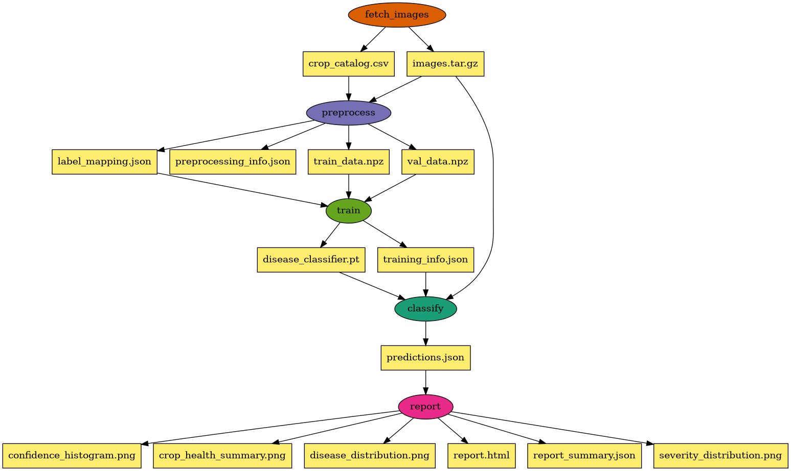

# Crop Health Workflow - Pegasus WMS on FABRIC

A Pegasus workflow system for detecting and classifying crop diseases from images using deep learning, with treatment and fertilizer recommendations.

## Overview

This workflow processes crop images through a CNN-based disease detection pipeline, providing actionable insights for farmers including disease identification, severity assessment, and treatment recommendations.

### Workflow Architecture

```
Image Source → Fetch/Catalog Images → Preprocess Images → Train Classifier
                                                               │
                        ┌──────────────────────────────────────┘
                        ↓
               Classify Diseases → Evaluate Accuracy → Generate Report → HTML + Charts + JSON
```

### DAG Visualization

The following diagram shows the workflow DAG:



### Workflow Modes

`--mode` selects which part of the pipeline to generate. `train` and `inference`
follow the ACCESS Pegasus tutorials
([05-Tutorial-ML-Training](https://github.com/pegasus-isi/ACCESS-Pegasus-Examples/tree/main/05-Tutorial-ML-Training),
[06-Tutorial-ML-Inference](https://github.com/pegasus-isi/ACCESS-Pegasus-Examples/tree/main/06-Tutorial-ML-Inference)):
train a model once, then reuse it over and over on new images.

| Mode | DAG |
|------|-----|
| `full` (default) | fetch → preprocess → train → classify → evaluate → report |
| `train` | [fetch →] preprocess → train |
| `inference` | classify (one job per image, in parallel) → merge → report |

```
inference:   classify_00 ─┐
             classify_01 ─┼─→ merge_predictions → generate_report
             classify_NN ─┘
```

Inference mode has no ground truth for the new images, so it skips
`evaluate_accuracy` and the report has no confusion matrix.

## Features

- **Multi-crop support**: Apple, Corn, Grape, Potato, Tomato, and more
- **38+ disease types**: Comprehensive disease detection across crops
- **CNN classification**: PyTorch-based deep learning with transfer learning
- **Severity scoring**: Critical, High, Moderate, Low, None
- **Treatment recommendations**: Actionable guidance for each disease
- **Fertilizer guidance**: Crop-specific fertilizer recommendations
- **Accuracy evaluation**: Per-class precision, recall, F1, and confusion matrix
- **Rich visualizations**: Distribution charts, confidence histograms, confusion matrix heatmap
- **HTML reports**: Professional reports with all findings including accuracy metrics
- **Train once, infer many times**: separate `train` and `inference` modes; inference fans out one job per image

## Running on ACCESS

The easiest way to run this workflow is using the provided Jupyter notebook on an ACCESS resource with Pegasus and HTCondor pre-configured:

**Notebook**: [`Access-CropHealth-workflow.ipynb`](Access-CropHealth-workflow.ipynb)

The notebook walks through the complete workflow: configuring parameters, generating the Pegasus DAG, submitting to HTCondor, monitoring execution, and examining results with inline visualizations.

## Running on FABRIC

The workflow can also be run on the [FABRIC testbed](https://fabric-testbed.net/) by deploying a distributed Pegasus/HTCondor cluster across FABRIC sites.

### Deploy a Pegasus/HTCondor Cluster

You can provision a cluster using either of the following notebooks:

| Option | Link | Description |
|--------|------|-------------|
| FABRIC Artifact (Recommended) | [Pegasus-FABRIC Artifact](https://artifacts.fabric-testbed.net/artifacts/53da4088-a175-4f0c-9e25-a4a371032a39) | Pre-configured notebook from the FABRIC Artifacts repository |
| Jupyter Examples | [pegasus-fabric.ipynb](https://github.com/fabric-testbed/jupyter-examples/blob/f7be0c75f22544c72d7b3e3fa42bbdfd9d8bb841/fabric_examples/complex_recipes/pegasus/pegasus-fabric.ipynb) | Notebook from the official FABRIC Jupyter examples |

Both notebooks provision the following cluster architecture:

- **Submit Node** -- Central Manager running HTCondor scheduler and Pegasus WMS
- **Worker Nodes** -- Distributed execution points across multiple FABRIC sites
- **FABNetv4 Networking** -- Private L3 network connecting all nodes

### Setup Steps

1. Log into the [FABRIC JupyterHub](https://jupyter.fabric-testbed.net/)
2. Upload or clone one of the Pegasus-FABRIC notebooks above
3. Configure your desired sites and node specifications
4. Run the notebook to provision the cluster
5. Clone this repository on the submit node
6. Run the workflow using the CLI (below) or the [Access notebook](Access-CropHealth-workflow.ipynb)

### Run the Workflow

SSH to the submit node and run:

```bash
cd crophealth-workflow

# Build the container first (see Quick Start step 1 for details)
apptainer build Apptainer/CropHealth_Container.sif \
    Apptainer/CropHealth_Container.def

# Generate workflow
./workflow_generator.py \
    --data-source kaggle \
    --kaggle-dataset emmarex/plantdisease \
    --image-size 128 \
    --epochs 10 \
    --output workflow.yml

# Submit to HTCondor
pegasus-plan --submit -s condorpool -o local workflow.yml

# Monitor
pegasus-status <run_directory>
```

## Prerequisites

### Software Requirements

- Python 3.9+
- Pegasus WMS v5.0+
- HTCondor v10.2+
- Apptainer (on the submit host to build, and on the worker nodes to run)

### Python Dependencies

```bash
pip install -r requirements.txt
```

### Kaggle API Setup (for PlantVillage dataset)

To download the PlantVillage dataset from Kaggle, you need to set up the Kaggle API:

**Step 1: Create a Kaggle Account**

1. Go to [https://www.kaggle.com/](https://www.kaggle.com/)
2. Click "Register" and create a free account
3. Verify your email address

**Step 2: Generate API Token**

1. Log in to Kaggle
2. Click on your profile icon (top right) → "Settings"
3. Scroll down to the "API" section
4. Click "Create New Token"
5. Copy the token value shown

**Step 3: Configure the API Token**

```bash
# Install the Kaggle package (preferred: kagglehub)
pip install kagglehub

# Or install the legacy client
pip install kaggle

export KAGGLE_USERNAME="your_kaggle_username"
export KAGGLE_KEY="your_kaggle_api_key"
```

**Step 4: Accept Dataset Rules**

1. Go to [https://www.kaggle.com/datasets/emmarex/plantdisease](https://www.kaggle.com/datasets/emmarex/plantdisease)
2. Click "Download" to accept the dataset's terms of use
3. You can cancel the download - you just need to accept the terms

Now you can use the Kaggle data source:

```bash
./fetch_crop_images.py --source kaggle --dataset emmarex/plantdisease \
    --output crop_catalog.csv
```

## Directory Structure

```
crophealth-workflow/
├── workflow_generator.py          # Workflow generator (full / train / inference modes)
├── custom_sites.py                # Site catalog (sites.yml): HTCondor, Slurm, hosted
├── fetch_crop_images.py           # Image fetcher/catalog creator
├── example_usage.sh               # Example usage script
├── bin/
│   ├── preprocess_images.py       # Image preprocessing and augmentation
│   ├── train_classifier.py        # CNN model training
│   ├── classify_disease.py        # Disease inference
│   ├── evaluate_accuracy.py       # Accuracy evaluation against ground truth
│   ├── merge_predictions.py       # Merge per-image predictions (inference mode)
│   └── generate_report.py         # Report generation
├── Apptainer/
│   └── CropHealth_Container.def   # Container definition (built to a .sif)
├── Docker/
│   └── CropHealth_Dockerfile      # Legacy Dockerfile, kept as a fallback
├── models/                        # Trained models
├── output/                        # Workflow outputs
└── README.md
```

## Quick Start

### 1. Build the Container

Do this first — the generator in step 4 expects the `.sif` to exist.

```bash
# Run from the workflow root. No registry push needed: Pegasus stages the .sif
# like any other input file.
apptainer build Apptainer/CropHealth_Container.sif \
    Apptainer/CropHealth_Container.def

# Verify
apptainer exec Apptainer/CropHealth_Container.sif \
    python -c "import torch, kagglehub, sklearn; print('ok')"
apptainer exec Apptainer/CropHealth_Container.sif which curl wget
```

`workflow_generator.py` looks for `Apptainer/CropHealth_Container.sif` by default
(override with `--container-sif`).

Apptainer cannot build on macOS, and a `.sif` is single-architecture — build on a
Linux host matching your worker nodes (an aarch64 pool needs its own `.sif` built
on an aarch64 host). See [`APPTAINER.md`](APPTAINER.md). The legacy
`Docker/CropHealth_Dockerfile` is kept as a fallback.

<details>
<summary>Optional: publish the image to ghcr.io</summary>

Useful for sharing one build across a team or citing an immutable artifact. Needs a
GitHub token with `write:packages`.

```bash
echo "$GHCR_TOKEN" | apptainer registry login --username <github-user> \
    --password-stdin oras://ghcr.io

TAG=$(git rev-parse --short HEAD)
apptainer push Apptainer/CropHealth_Container.sif \
    oras://ghcr.io/pegasus-isi/crophealth-workflow:$TAG

# On the submit host, pull back to the path the generator expects
apptainer pull Apptainer/CropHealth_Container.sif \
    oras://ghcr.io/pegasus-isi/crophealth-workflow:$TAG
```

Do **not** put the `oras://` URL in the transformation catalog — Pegasus supports
`docker://`, `shub://`, `library://`, `shifter://` and `file://`, not `oras://`.
Treat ghcr.io as a distribution channel and keep staging the local `.sif`. Details in
[`APPTAINER.md`](APPTAINER.md).

</details>

### 2. Prepare Your Images

Organize images in disease categories:

```
field_images/
├── Tomato___Early_blight/
│   ├── image1.jpg
│   └── image2.jpg
├── Tomato___healthy/
│   └── image3.jpg
├── Potato___Late_blight/
│   └── image4.jpg
```

### 3. Create Image Catalog

```bash
cd crophealth-workflow

# From local images
./fetch_crop_images.py --source local --input-dir ./field_images \
    --output crop_catalog.csv

# Or use sample data for testing
./fetch_crop_images.py --source sample --output crop_catalog.csv

# Or download from Kaggle (requires API key)
./fetch_crop_images.py --source kaggle --dataset emmarex/plantdisease \
    --output crop_catalog.csv
```

### 4. Generate Workflow

#### Full Mode
##### Using pre downloaded local data
```bash
./workflow_generator.py \
    --data-source local \
    --image-dir ./field_images \
    --image-size 128  \
    --epochs 10  \
    --batch-size 16 \
    --output workflow.yml
```
##### Download data from Kaggle
```bash
./workflow_generator.py  \
    --data-source kaggle  \
    --kaggle-dataset emmarex/plantdisease \
    --image-size 128  \
    --epochs 10  \
    --batch-size 16 \
    --output workflow.yml
```

#### Train Mode

Preprocess and train only. `--data-source remote` uses the catalog and image
archive hosted at `--base-url` (the ACCESS tutorial dataset) instead of a fetch
job; `--gpu` requests a GPU for the training job.

```bash
./workflow_generator.py \
    --mode train \
    --data-source remote \
    --gpu \
    --output workflow.yml
```

#### Inference Mode

Classify images with an already trained model, one job per image. With no
options it uses the hosted model and the 10 hosted sample images
(`<base-url>/inference/00.jpg` … `09.jpg`):

```bash
./workflow_generator.py --mode inference --output workflow.yml
```

To use the model from a training run and your own images (files, directories or
URLs):

```bash
./workflow_generator.py \
    --mode inference \
    --model-dir ./output \
    --inference-images ./new_field_images \
    --output workflow.yml
```

### 5. Choose Where It Runs

The workflow itself names no scheduler. Each job states only cores, memory
and a wall-clock `runtime`, and the `train_classifier` job carries the Pegasus
tag `train`. Everything site-specific goes in `sites.yml`, which the generator
manages through `custom_sites.py` (the same module as in airquality-workflow)
using these rules, most specific first:

1. **A `sites.yml` entry you provided** for the execution site is kept
   untouched, whether you wrote it by hand or with `custom_sites.py`.
2. **A hosted catalog** named in `~/.pegasusrc`
   ([pegasushub/pegasus-site-catalogs](https://github.com/pegasushub/pegasus-site-catalogs/tree/main/conf),
   e.g. ACCESS or Unity) is used as-is, and Pegasus merges `sites.yml` over it.
3. **Otherwise, an HTCondor site is added.** With no options at all, the
   generator writes `condorpool` plus a `local` site with output in `./output`.

Only the execution site's entry is ever written, plus `local` if it is
missing. Other entries in `sites.yml` are kept.

**HTCondor pool (default):**

```bash
./workflow_generator.py
```

**Slurm cluster**, training on a GPU partition:

```bash
./workflow_generator.py -e compute --site-style slurm \
    --queue cpu --project my_lab --site-scratch /scratch/$USER/crophealth \
    --gpu --train-profile pegasus:queue=gpu      # train_classifier only
```

**Hosted catalog (ACCESS, Unity):**

```bash
echo "pegasus.catalog.site.repo.file = unity.yml" >> ~/.pegasusrc
./workflow_generator.py -e compute --site-style slurm --project my_lab
```

On ACCESS the setup notebook already names the hosted catalog in
`~/.pegasusrc`; `Access-CropHealth-workflow.ipynb` detects it and plans against
`compute`.

Against a hosted catalog, `--site-style slurm` writes only your overrides
(account, queue, profiles) plus the site's submission style, rather than a
whole site. A style that contradicts the hosted catalog is rejected. A site
the hosted catalog does not define (e.g. `-e condorpool --site-style condor`
next to a hosted `compute`) gets a complete entry instead; without
`--site-style`, the generator warns that planning against it will fail.

| Option | Default | Meaning |
|---|---|---|
| `-e, --execution-site` | `compute` with a hosted catalog, else `condorpool` | Site to plan against. Hosted catalogs call theirs `compute`. |
| `--site-style` | `auto` | `auto`: keep what exists, else add an HTCondor site. `condor`/`slurm`: (re)write this site's entry. `none`: don't touch `sites.yml`. |
| `--queue`, `--project` | — | Partition and account on a batch site (`pegasus.queue`, `pegasus.project`). |
| `--site-scratch` | `./work` | Slurm: shared scratch visible to the workers and the submit host. |
| `--site-profile NS:KEY=VALUE` | — | Any other site profile, e.g. `pegasus:glite.arguments=--constraint=avx512`. Repeatable. |
| `--train-profile NS:KEY=VALUE` | — | Profiles for the `train` tag only (`train_classifier`), e.g. `pegasus:queue=gpu` or `pegasus:runtime=43200`. Repeatable. |
| `--shared-filesystem` | `auto` | Let jobs read inputs, including the `.sif`, straight from the submit host (`pegasus.transfer.bypass.input.staging`). `auto` turns it on for Slurm/glite sites and off for HTCondor. |
| `--sites-yml` | `sites.yml` | Site catalog file, named in the generated `pegasus.properties`. |

`./custom_sites.py` runs the same logic on its own, for preparing a
`sites.yml` once and reusing it (`./custom_sites.py --help`).

Notes:

- **Slurm submission** goes through HTCondor's glite/BLAHP, so plan on the
  cluster's login node with HTCondor and Pegasus installed.
- **Tags** (`train`, and `x-tags` in `sites.yml`) need Pegasus 6.0
  (or 5.1.3dev) at plan time. Older planners ignore them.
- **Runtime budgets** (`TOOL_RUNTIME` in `workflow_generator.py`) are
  generous: 6 h for training and 15–60 min for everything else. Batch sites
  kill a job that exceeds its budget; condor pools ignore it. Raise training's
  with `--train-profile pegasus:runtime=<seconds>` for long CPU-only runs.
- **Worker package.** When `pegasus-version` is on the PATH, the generator
  stages a container-compatible Pegasus worker package (`rhel_8`, matched to
  that version) as `pegasus::worker` and turns off downloading inside jobs.
  This works whatever the submit host's OS or Pegasus build is, and without
  curl in the image.
- **Container bind.** On batch sites the container binds the workflow
  directory, because staged inputs are symlinks into it and PegasusLite starts
  containers with `--no-home`. Without the bind, every job fails with
  kickstart "Unable to execute the specified binary" (exit 127). This bind is
  never added on a condor pool.

### 6. Submit

```bash
pegasus-plan --submit -s condorpool -o local workflow.yml

# Monitor
pegasus-status <run_directory>
```

Use the site you generated for: the generator prints the exact command.

### 7. View Results

```
output/
├── crop_catalog.csv              # Image catalog
├── train_data.npz                # Preprocessed training data
├── val_data.npz                  # Preprocessed validation data
├── disease_classifier.pt         # Trained model
├── predictions.json              # Disease predictions
├── accuracy_results.json         # Accuracy metrics and confusion matrix
├── report/
│   ├── report.html               # HTML report with accuracy metrics
│   ├── disease_distribution.png  # Disease distribution chart
│   ├── severity_distribution.png # Severity chart
│   ├── crop_health_summary.png   # Crop-wise summary
│   └── confusion_matrix.png      # Confusion matrix heatmap
```

## Helper Scripts

For quick local testing, use the provided scripts:

- `example_usage.sh` shows a lightweight Kaggle-based walkthrough.
- `run_manual.sh` runs the full manual pipeline end-to-end using Kaggle.

Note: You must accept the dataset terms at https://www.kaggle.com/datasets/emmarex/plantdisease before downloading.

## Configuration Options

### Workflow Generator Arguments

| Argument | Description | Default |
|----------|-------------|---------|
| `--mode` | `full`, `train` or `inference` | full |
| `--data-source` | Training image source (local, kaggle, sample, remote) | sample |
| `--base-url` | Hosted inputs for `remote` data and `inference` mode | https://download.pegasus.isi.edu/tutorial/crophealth |
| `--image-dir` | Local image directory | - |
| `--kaggle-dataset` | Kaggle dataset name | emmarex/plantdisease |
| `--image-size` | Target image size | 224 |
| `--train-split` | Training fraction | 0.8 |
| `--epochs` | Training epochs | 20 |
| `--batch-size` | Training batch size | 32 |
| `--gpu` | Request a GPU for `train_classifier` | False |
| `-e, --execution-site` | Execution site; see [Choose Where It Runs](#5-choose-where-it-runs) for the other site options | compute with a hosted catalog, else condorpool |
| `--container-sif` | Apptainer image | Apptainer/CropHealth_Container.sif |
| `-o, --output` | Output workflow file | workflow.yml |

### Inference Mode Arguments

| Argument | Description | Default |
|----------|-------------|---------|
| `--model-dir` | Directory with `disease_classifier.pt` and `training_info.json` | model at `--base-url` |
| `--inference-images` | Images to classify: files, directories or URLs | hosted samples |
| `--num-remote-images` | Hosted samples to use when `--inference-images` is not given | 10 |
| `--gpu-inference` | Request a GPU for each classify job | False |

## Supported Diseases

### Apple
| Disease | Severity | Treatment |
|---------|----------|-----------|
| Apple Scab | Moderate | Fungicide (captan, mancozeb) |
| Black Rot | High | Remove infected fruit/branches |
| Cedar Apple Rust | Moderate | Remove cedars, apply fungicide |

### Corn
| Disease | Severity | Treatment |
|---------|----------|-----------|
| Gray Leaf Spot | Moderate | Resistant varieties, fungicide |
| Common Rust | Moderate | Fungicide, resistant hybrids |
| Northern Leaf Blight | Moderate | Crop rotation, fungicide |

### Grape
| Disease | Severity | Treatment |
|---------|----------|-----------|
| Black Rot | High | Mancozeb/myclobutanil fungicide |
| Esca | High | Prune infected wood (no cure) |
| Leaf Blight | Moderate | Fungicide application |

### Potato
| Disease | Severity | Treatment |
|---------|----------|-----------|
| Early Blight | Moderate | Chlorothalonil/copper fungicide |
| Late Blight | Critical | Destroy plants, immediate fungicide |

### Tomato
| Disease | Severity | Treatment |
|---------|----------|-----------|
| Bacterial Spot | Moderate | Copper-based bactericide |
| Early Blight | Moderate | Fungicide, remove lower leaves |
| Late Blight | Critical | Destroy infected plants |
| Leaf Mold | Moderate | Improve ventilation, fungicide |
| Septoria Leaf Spot | Moderate | Remove leaves, fungicide |
| Yellow Leaf Curl Virus | High | Remove plants, control whiteflies |
| Mosaic Virus | High | Remove plants, sanitize tools |

## Output Files

### Predictions JSON

```json
{
  "predictions": [
    {
      "filename": "tomato_leaf_001.jpg",
      "crop": "Tomato",
      "disease": "Early Blight",
      "is_healthy": false,
      "confidence": 0.9523,
      "treatment": {
        "severity": "moderate",
        "action": "Apply copper-based fungicide",
        "prevention": "Mulch around plants, avoid overhead watering",
        "fertilizer": "Calcium and potassium to strengthen plants"
      }
    }
  ],
  "summary": {
    "total": 100,
    "healthy": 25,
    "diseased": 75,
    "disease_breakdown": {
      "Early Blight": 30,
      "Late Blight": 15,
      "Healthy": 25
    }
  },
  "critical_alerts": [
    {
      "image": "potato_leaf_042.jpg",
      "disease": "Late Blight",
      "action": "Destroy infected plants immediately"
    }
  ]
}
```

### Accuracy Results JSON

```json
{
  "evaluated_at": "2026-02-04T12:00:00",
  "overall_accuracy": 0.95,
  "total_evaluated": 4627,
  "correct": 4400,
  "incorrect": 227,
  "unmatched": 0,
  "per_class": {
    "Pepper__bell___Bacterial_spot": {
      "total": 997, "correct": 980, "accuracy": 0.983,
      "precision": 0.98, "recall": 0.983, "f1": 0.981
    }
  },
  "confusion_matrix": {
    "labels": ["Pepper__bell___Bacterial_spot", "..."],
    "matrix": [[980, 5], [3, 500]]
  }
}
```

### HTML Report

Interactive HTML report with:
- Summary statistics
- Critical alerts
- Accuracy metrics (overall and per-class precision/recall/F1)
- Confusion matrix heatmap
- Disease distribution charts
- Severity breakdown
- Treatment recommendations
- Detailed results table

## Advanced Usage

### Training with GPU

In a workflow, pass `--gpu` to the generator: the `train_classifier` job then
requests a GPU and uses CUDA. To train by hand:

```bash
./bin/train_classifier.py \
    --input-dir ./processed \
    --output-dir ./models \
    --epochs 50 \
    --device cuda
```

### Custom Container

See [Quick Start step 1](#1-build-the-container) for the build command, and
[`APPTAINER.md`](APPTAINER.md) for the definition-file reference and the
ghcr.io publishing recipe. Point the generator at a different image with
`--container-sif /path/to/your.sif`.

### Using Pre-trained Model

As a workflow, use [Inference Mode](#inference-mode). By hand:

```bash
./bin/classify_disease.py \
    --model-dir ./pretrained_models \
    --input ./new_field_images \
    --output predictions.json
```

## Troubleshooting

### Common Issues

**1. No images found**
- Verify image directory structure matches expected format
- Check file extensions (.jpg, .jpeg, .png)
- Ensure category folders follow `Crop___Disease` naming

**2. Training fails with memory error**
- Reduce batch size (`--batch-size 16`)
- Reduce image size (`--image-size 128`)
- Use sklearn fallback (`--use-sklearn`)

**3. Low classification accuracy**
- Increase training epochs
- Ensure sufficient training data (100+ images per class)
- Try data augmentation

**4. Inference `merge` job fails with "No successful predictions"**
- Every classify job failed to read its image; check the per-image
  `*_predictions.json` files for the `error` field

### Debugging

```bash
# View Pegasus logs
pegasus-analyzer <run_directory>

# Check job logs
cat <run_directory>/work/<job_name>/*.err
cat <run_directory>/work/<job_name>/*.out
```

## Related Resources

- [PlantVillage Dataset](https://www.kaggle.com/datasets/emmarex/plantdisease)
- [PyTorch Documentation](https://pytorch.org/docs/)
- [Pegasus WMS Documentation](https://pegasus.isi.edu/documentation/)
- [FABRIC Testbed](https://portal.fabric-testbed.net/)

## Citation

```
@misc{crophealth-workflow,
  title={Crop Disease Detection Workflow using Pegasus WMS},
  year={2025},
  publisher={GitHub},
  url={https://github.com/pegasus-isi/crophealth-workflow}
}
```

## License

This workflow is released under the same license as the parent repository.

## Contributing

Contributions welcome! Please submit issues or pull requests for:
- Additional crop/disease types
- Improved ML models
- New data sources
- Performance improvements

---
## Authors
Komal Thareja (kthare10@renci.org)

Built with the assistance of Claude.
